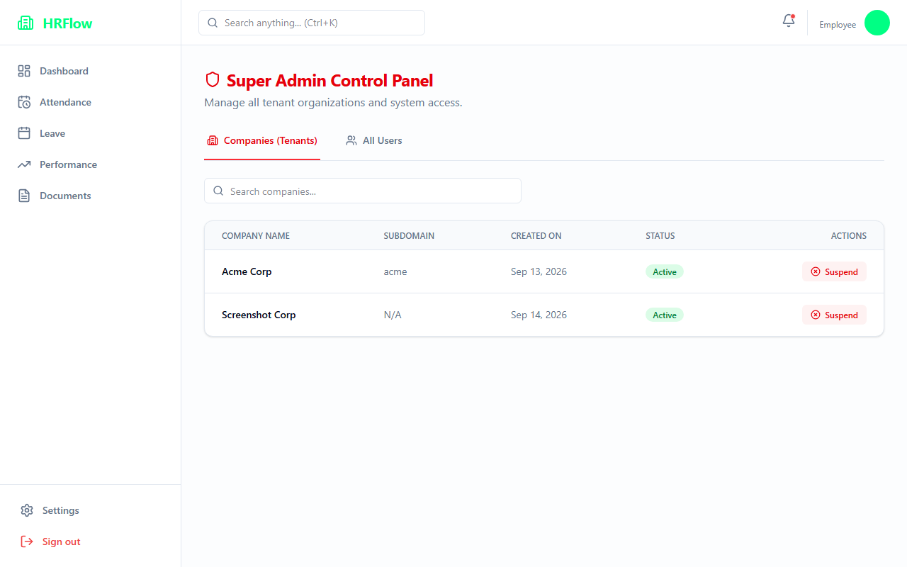
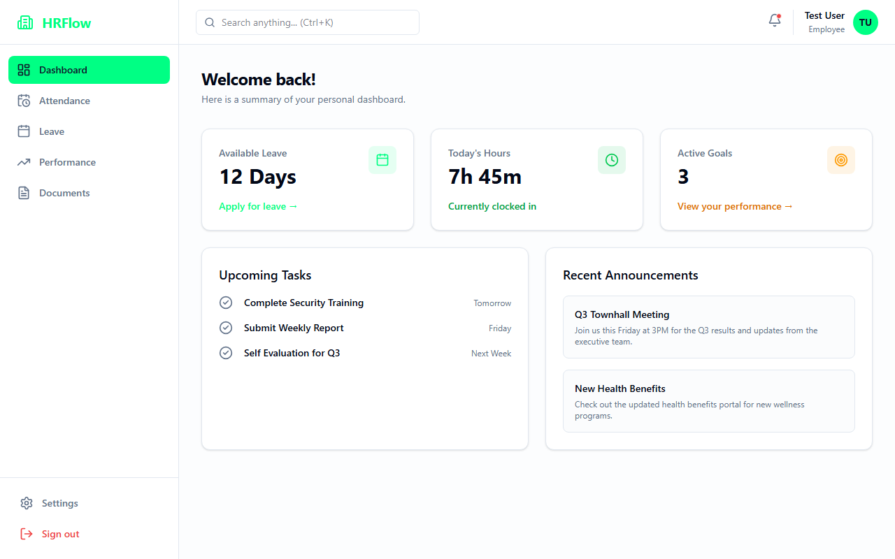
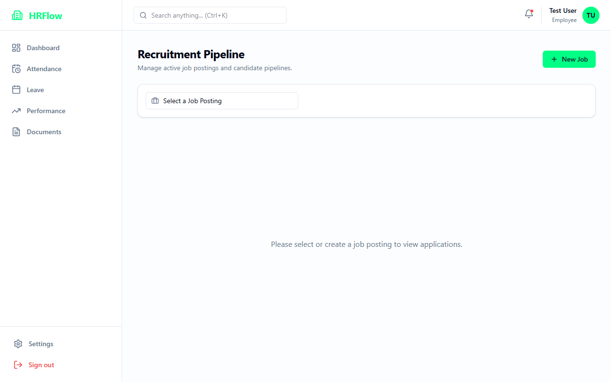
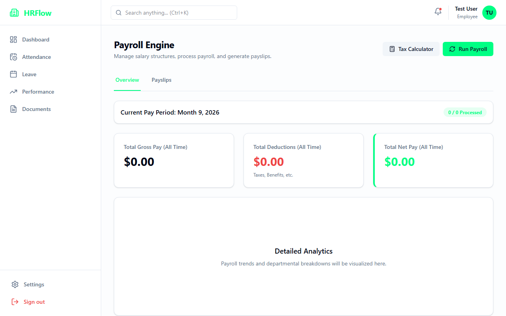

# HRFlow - Modern Multi-Tenant HRMS 🚀

HRFlow is a state-of-the-art, multi-tenant Human Resources Management System designed to handle core HR tasks, recruitment, payroll, performance tracking, IT asset management, and leave management seamlessly across multiple organizations within a single deployment.

---

## 🌟 Key Features

- **Multi-Tenant Architecture**: Isolate data securely between different companies (Tenants/Organizations) on the same platform.
- **Super Admin Dashboard**: Centralized control panel for system owners to onboard new companies and manage overall system access.
- **Comprehensive HR Dashboard**: Real-time insights, metrics, and quick actions tailored to individual users and HR Admins.
- **Recruitment & ATS**: Kanban-style job tracking, public career pages, and applicant tracking.
- **Payroll Engine**: Automated salary calculations, interactive tax simulator, and payslip generation.
- **Performance Management**: 360-degree feedback, KPI tracking, and Goal assignments.
- **IT Assets & Documents**: Track hardware inventory and host company-wide documentation securely.
- **Leave & Attendance**: Fully functional leave approval workflows and attendance tracking.

---

## 🛠️ Tech Stack

### Frontend
- **Framework**: React 18 with Vite
- **Language**: TypeScript
- **Styling**: Tailwind CSS & Lucide Icons
- **State Management**: TanStack React Query & Context API
- **Routing**: React Router DOM
- **Charts**: Recharts

### Backend
- **Framework**: Django & Django REST Framework (DRF)
- **Language**: Python 3.12+
- **Authentication**: JWT (Simple JWT)
- **Database**: SQLite (Development) / PostgreSQL Ready (Production)
- **Architecture**: Multi-Tenant Schema via `TenantAwareModelViewSet`

---

## 📸 Screenshots

*(Replace the placeholders below with actual images of your application)*

### 1. Super Admin Dashboard
*Manage all tenant organizations and suspend/activate access dynamically.*


### 2. Multi-Tenant Dashboard
*The central hub showing real-time metrics for the logged-in organization.*


### 3. Recruitment & ATS
*Manage job postings and candidates via a Kanban board.*


### 4. Payroll Simulator
*Simulate taxes and run organization-wide payroll.*


---

## 🚀 Step-by-Step Installation Guide

Follow these steps to run HRFlow locally on your machine.

### Prerequisites
- Node.js (v18 or higher)
- Python (v3.10 or higher)
- Git

### 1. Clone the Repository
```bash
git clone https://github.com/yourusername/hrflow.git
cd hrflow
```

### 2. Backend Setup (Django)
Open a terminal and navigate to the `backend` directory.

```bash
cd backend

# Create a virtual environment
python -m venv venv

# Activate the virtual environment
# On Windows:
venv\Scripts\activate
# On macOS/Linux:
source venv/bin/activate

# Install dependencies
pip install -r requirements.txt

# Apply database migrations
python manage.py migrate

# Create a Super Admin user
python manage.py createsuperuser
# (Follow the prompts to set email and password)

# Start the Django server
python manage.py runserver
```
*The backend will now be running at `http://127.0.0.1:8000/`.*

### 3. Frontend Setup (React/Vite)
Open a new terminal window and navigate to the `frontend` directory.

```bash
cd frontend

# Install Node modules
npm install

# Start the Vite development server
npm run dev
```
*The frontend will now be running at `http://localhost:5173/`.*

---

## 🔑 Usage & Access

1. Open `http://localhost:5173/` in your browser.
2. Log in using the Super Admin credentials you created during the backend setup.
3. You will be redirected to the **Super Admin Control Panel** (or you can navigate to `/super-admin`).
4. Click **Create Organization** to onboard a new company, or use the sign-up page to register a new tenant.
5. Log in with the newly created company credentials to access the full HR Dashboard isolated to that specific organization.

---

## 📄 API Documentation

HRFlow's backend automatically handles tenant isolation. 
When making API requests, the frontend sends the JWT Token which contains the user's Organization ID. All Data (Employees, Jobs, Assets, Payslips) is automatically filtered at the query level by the `TenantAwareModelViewSet`.

Key Endpoints:
- `/api/v1/auth/login/` - JWT Authentication
- `/api/v1/super-admin/organizations/` - Super Admin Organization Management
- `/api/v1/employees/` - Employee CRUD
- `/api/v1/payroll/` - Payroll Engine

---

## 🤝 Contributing
Contributions, issues, and feature requests are welcome!
Feel free to check [issues page](https://github.com/yourusername/hrflow/issues).

## 📝 License
This project is licensed under the MIT License - see the LICENSE file for details.
